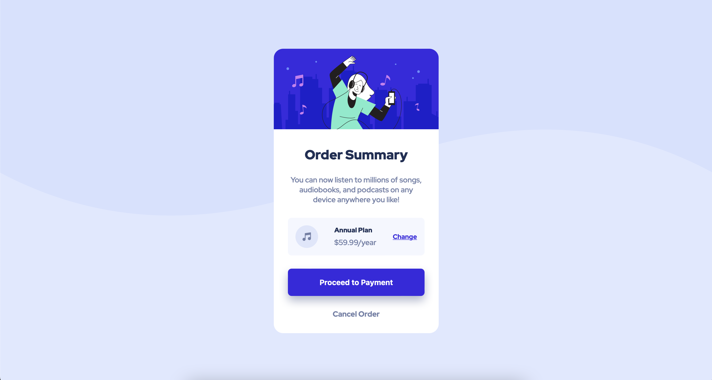

# Frontend Mentor - Order summary card solution

This is a solution to the [Order summary card challenge on Frontend Mentor](https://www.frontendmentor.io/challenges/order-summary-component-QlPmajDUj). Frontend Mentor challenges help you improve your coding skills by building realistic projects.

## Table of contents

- [Overview](#overview)
  - [The challenge](#the-challenge)
  - [Screenshot](#screenshot)
  - [Links](#links)
- [My process](#my-process)
  - [Built with](#built-with)
  - [What I learned](#what-i-learned)
  - [Continued development](#continued-development)
  - [Useful resources](#useful-resources)
- [Author](#author)
- [Acknowledgments](#acknowledgments)

**Note: Delete this note and update the table of contents based on what sections you keep.**

## Overview

### The challenge

Users should be able to:

- See hover states for interactive elements

### Screenshot

### Links

- Solution URL: [Add solution URL here](https://edbizichjr.github.io/order-summary-component-main/)
- Live Site URL: [Add live site URL here](https://edbizichjr.github.io/order-summary-component-main/)

## My process

I first started by dragging the design reference into Figma to get an idea for spacing. Then I went and started blocking things out in HTML is what made sense to me. After that iI started writing my css and things started to come together.

### Built with

- Semantic HTML5 markup
- CSS custom properties
- Flexbox
- CSS Grid

### Continued development

I want to continue to focus on ways to streamline my CSS and make things more organized and use less lines of code.

## Author

- Website - [Ed Bizich Jr](https://www.edbizichjr.com)
- Frontend Mentor - [@yourusername](https://www.frontendmentor.io/profile/yourusername)
